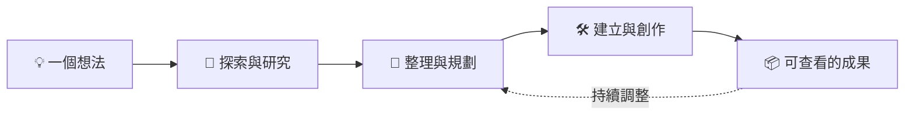

# Manus ai - Cue agnet

<div align="center">

[](https://cue.im/)
[](https://cue.im/)
[](https://cue.im/)

# ✦ Cue

### **把想法，推進成看得見的成果。**

研究 · 規劃 · 創作 · 執行

[✨ 開始探索 Cue](https://cue.im/)

</div>

---

> [!TIP]
> **不只回答問題，也陪你把事情往前推。**
> 從一個清楚的目標開始，Cue 可以協助你蒐集資訊、整理思路、製作內容與檔案，讓下一步更容易開始。

## ◈ 從靈感，到交付



## 🚀 一個助手，多種工作方式

| 能力 | 可以怎麼幫忙 |
| --- | --- |
| 🔎 **研究與整理** | 查找公開資訊、比較選項、摘要重點，並整理成容易閱讀的內容。 |
| ✍️ **寫作與企劃** | 起草文案、教學、報告、流程與企劃，依你的回饋持續修訂。 |
| 🎨 **創作與呈現** | 協助製作簡報、視覺素材、網頁原型與其他可分享的成果。 |
| 🧩 **工具與流程** | 依任務使用可用的工具、應用程式與 Skills，處理多步驟工作。 |
| 🤝 **Agent 與協作** | 建立有專屬指示與記憶的 Agent，也可以讓多位 Agent 在群組中協作。 |
| ⏱️ **持續性工作** | 為適合的工作設定排程或自動化，讓重複任務更有節奏。 |

## ✦ 讓每個 Agent 都有自己的工作風格

給 Agent 一個清楚的角色與目標，它就能依照你設定的指示與記憶，協助處理不同類型的工作。再搭配 Apps 與 Skills，讓它接上合適的工具與專長。

> **一個想法，不必一次講得完美。**
> 先說你想達成什麼，再一起補上細節、檢查成果、調整方向。

## 🪄 這樣開始就好

```text
「幫我研究這個主題，整理可信來源與重點差異。」

「把這些零散想法整理成一份清楚、可以分享的文案。」

「根據這個需求，先做出可預覽的網頁原型。」

「把這個重複工作整理成固定流程，並告訴我需要哪些設定。」
```

### 工作進度可以這樣看

- [x] 說清楚要達成的目標
- [x] 讓 Cue 拆解並完成合適的步驟
- [ ] 查看成果，提出調整方向
- [ ] 把成果帶到下一個工作流程

> [!IMPORTANT]
> **好的結果來自清楚的目標與持續校對。** 涉及外部帳號、資料或重要操作時，請確認內容與權限符合你的預期；能否執行也會依當下可用的工具與服務而不同。

<details>
<summary><strong>展開：讓 Cue 更貼近你的工作方式</strong></summary>

<br>

- 建立不同用途的 Agent，分別設定角色、指示與記憶。
- 使用 Group Chat，讓多位 Agent 一起討論與協作。
- 為合適的工作加入 Apps 或 Skills。
- 需要重複執行時，探索排程與自動化選項。
- 在手機或桌面 App 延續對話與工作；已連接的帳戶資料會隨帳戶使用。

</details>

---

<div align="center">

### **少一點來回，多一點完成。**

[](https://cue.im/)

<sub>研究得更清楚，創作得更自在，把下一步交給行動。</sub>

</div>

